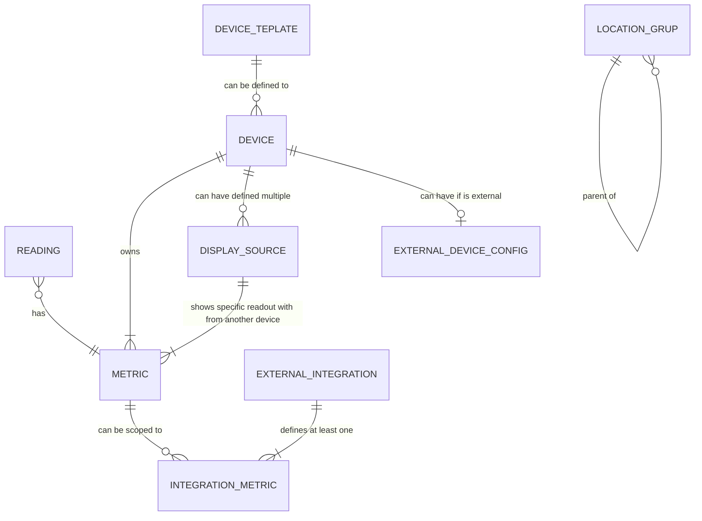

# Datatabase main entities

**Device** - IoT device that is either sensor device (gather data) or display device (present data)

**Reading** - entity of momentary sensor device readout (momentary readouts at specific times)

**Metric** - derfines what kind of data can be measured (unit of measurement, data type, sensor specific metadata)

**Display source** - junction entity that describes a "who shows what" between display devices and sensor devices, each display device can present data from multiple sensor devices (through specific metric). Device can have multiple display sources that come by metric from another device. 

**External device** - external device additional configuration if the device is from external sources (provides definition on protocol, pushing/pooling, etc.). It is not existing for standard devices (either local sensors or displays). Defined as external entity to differenciate from standard devices that cannot use that configuration (local configuration is above external, if defined external entity for device then internal fields have to be cleared).

**External integration** - exporting or syncing scoped data to outside systems (webhooks, external DBs, APIs etc.). An integration must have at least one metric defined (external integration is defined if it provides at least one readout)

**Integration metric** - junction entity that defines which metrics are scoped to external integration. Metric scoped to zero means that the external integration is not defined (system scope). 

**DEVICE_TEMPLATE** - definition of the specific sensor type that can is used during the device definition (as the defaults) hardware soecific defaults.

Define entities:
- device groups - managing devices within a group, cluster devices logically by room, section, floor, building, function
a) device template - blueprint of the standard internal device for the specific model that enables for dafaulkt values during setup
b) location group - free form hierarchcal groiuping (no matter the device model)
c) device group - flat grouping of the same sensor model (to manage few devices at a time)

- device tagging - tagging similar devices, managing tags, ..could be within device entity fields tho

- external integration types - external integration as the dataset definition can be provided in the same form to the multiple receivers (like hooks etc. at the same time ... data scope is the same but defining each is cumbersome if we have defined data scope already)
- alert/treshold - alerts if the readouts crosses specified treshold then make action in system (message, notification, hook etc.)

- logs - tracking the device events (readouts, reboots, failures, config changes, offline) through a course of the time to analyze if the device have faults or unexpected behaviours

- user/account
- RBA (role based access)

Define the entities structure and what is important in them ...

## Entities definition

