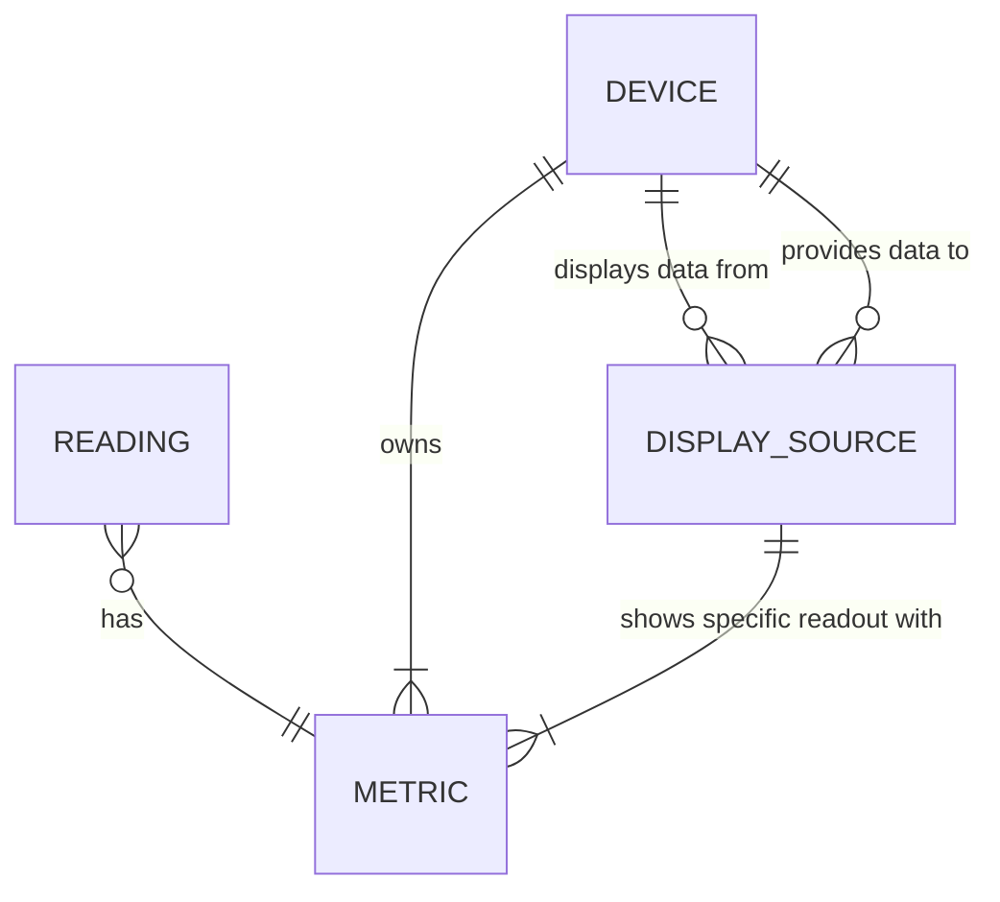

# Datatabase main entities

**Device** - IoT device that is either sensor device (gather data) or display device (present data)
**Reading** - entity of momentary sensor device readout (momentary readouts at specific times)
**Metric** - derfines what kind of data can be measured (unit of measurement, data type, sensor specific metadata)
**Display source** - junction entity that describes a "who shows who" between display devices and sensor devices, each display device can present data from multiple sensor devices
**External subscriber** - .........................................

The things to think of:
1) Should we drop the source association aka. 'provides data to' as it is redundant (we can get the souce device via metric)
2) How we should handle external data subscribers?
3) Do we enable data to be provided to that hub system (sensor readouts from external systems?) .. it would be nice to have

Define the entities structure and what is important in them ...

## Entities definition

